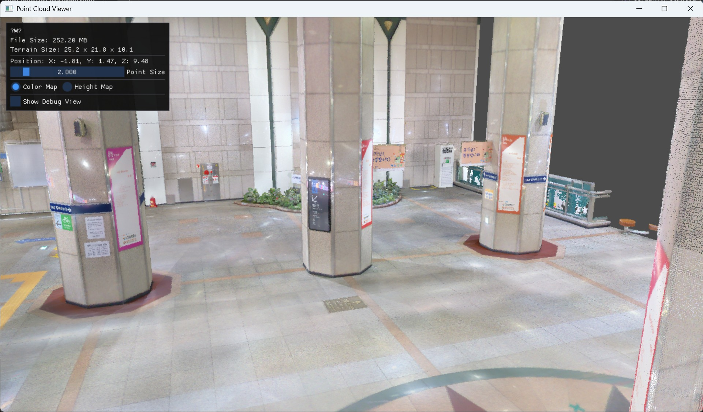

# Point Cloud Viewer

[English](#english) | [한국어](#korean)

---

##  English

### Overview
A high-performance large-scale 3D point cloud (`.las`) visualization engine built with **Vulkan 1.3** and an **Out-of-Core** architecture. Designed to smoothly render massive spatial datasets in real-time without being constrained by Main RAM or VRAM limits.

### Key Features
- **Vulkan 1.3 Dynamic Rendering**: Simplified pipeline by removing `VkRenderPass` and `VkFramebuffer` boilerplate.
- **Asynchronous Resource Streaming**: Utilizes Timeline Semaphores via a custom `TransferManager` to handle background GPU data transfers without stuttering.
- **Out-of-Core Octree**: Partitions spatial data into chunks and serializes them to local disk for managing datasets exceeding RAM capacity.
- **LRU Cache Buffer Management**: Asynchronously loads visible chunks and automatically evicts least recently used GPU buffers to optimize VRAM.
- **View-Frustum Culling**: Minimizes CPU/GPU overhead by discarding Octree nodes outside the camera's view.
- **Real-time Debug Viewport**: A Picture-in-Picture (PiP) ImGui overlay to visualize Octree bounding boxes and Frustum Culling status.

### Build Requirements
- **OS**: Windows 10 / 11 (64-bit)
- **Compiler**: Visual Studio 2022+ (C++20)
- **Dependencies (vcpkg)**: `pdal`, `vulkan`, `vulkan-memory-allocator`, `glm`, `imgui[vulkan-binding,win32-binding]`

### Usage
- **Load**: Drag and drop a `.las` file into the application window.
- **Rotate Camera**: Right-Click + Drag.
- **Move Camera**: `W`, `A`, `S`, `D`, `Q` (Down), `E` (Up).

### TODO & Known Issues
- [ ] **Crash on Reloading**: Fix an issue where the application crashes if a new `.las` file is dragged and dropped while another `.las` file is already loaded.

---

##  한국어

### 개요
**Vulkan 1.3** 및 **Out-of-Core** 아키텍처 기반의 고성능 대용량 3D 포인트 클라우드(`.las`) 시각화 엔진입니다. 메인 메모리(RAM)와 비디오 메모리(VRAM) 한계에 구애받지 않고 대규모 공간 데이터를 부드럽게 실시간 렌더링할 수 있도록 설계되었습니다.

### 주요 특징
- **Vulkan 1.3 Dynamic Rendering**: `VkRenderPass`와 `VkFramebuffer` 객체를 제거하여 파이프라인을 효율화했습니다.
- **비동기 자원 스트리밍**: 타임라인 세마포어(Timeline Semaphore) 기반의 `TransferManager`를 구축하여 GPU 데이터 전송을 메인 스레드 끊김 없이 비동기로 처리합니다.
- **Out-of-Core 옥트리(Octree)**: RAM 용량을 초과하는 데이터를 처리하기 위해 공간을 분할하고 로컬 디스크에 청크(Chunk) 단위로 직렬화합니다.
- **LRU 캐시 버퍼 관리**: 화면에 보이는 가시 청크만 로드하며, **LRU(Least Recently Used)** 알고리즘으로 오랫동안 참조되지 않은 GPU 메모리를 자동 해제합니다.
- **시야 절두체 컬링 (Frustum Culling)**: 카메라 시야 밖의 옥트리 노드를 렌더링에서 배제하여 부하를 최소화합니다.
- **실시간 디버깅 뷰포트**: ImGui를 활용해 바운딩 박스와 컬링 상태를 탑다운 뷰(PiP)로 실시간 검증할 수 있습니다.

### 빌드 요구 사항
- **운영체제**: Windows 10 / 11 (64-bit)
- **컴파일러**: Visual Studio 2022 이상 (C++20)
- **의존성 (vcpkg)**: `pdal`, `vulkan`, `vulkan-memory-allocator`, `glm`, `imgui[vulkan-binding,win32-binding]`

### 사용 방법
- **로드**: `.las` 파일을 실행된 프로그램 창에 드래그 앤 드롭합니다.
- **카메라 회전**: 마우스 우클릭 + 드래그.
- **카메라 이동**: 키보드 `W`, `A`, `S`, `D` 및 `Q`(하강), `E`(상승).

### TODO (알려진 문제점)
- [ ] **재로드 시 크래시**: 이미 `.las` 파일이 로드된 상태에서 새로운 `.las` 파일을 드래그 앤 드롭으로 로드할 경우 프로그램이 크래시되는 문제 수정.
